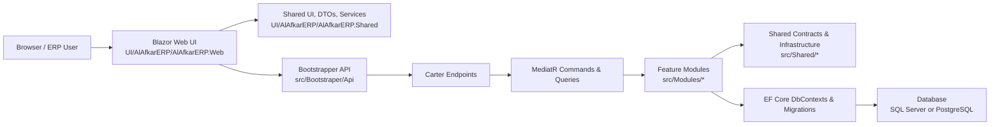

# AlAfkar ERP

[](https://dotnet.microsoft.com/)
[](https://dotnet.microsoft.com/apps/aspnet/web-apps/blazor)
[](https://www.postgresql.org/)
[](https://docs.docker.com/compose/)
[](https://github.com/CarterCommunity/Carter)
[](https://github.com/jbogard/MediatR)
[](https://learn.microsoft.com/ef/core/)
[](#security-notes)

AlAfkar ERP is a modular enterprise resource planning platform built with .NET 10, Blazor Server, Carter, MediatR, and Entity Framework Core. The solution is organized as a modular monolith: each business domain owns its endpoints, handlers, data access, contracts, and UI surface while sharing common infrastructure and reusable UI services.

## Overview

This repository contains the backend API, Blazor web UI, shared contracts, module implementations, and supporting UAT documentation for the AlAfkar ERP platform.

| Area | Purpose |
| --- | --- |
| API bootstrapper | Hosts Carter endpoints, authentication, authorization, exception handling, and module registration. |
| Feature modules | Encapsulate business capabilities such as Auth, Organization, Employee, Catalog, Inventory, Sales, Payroll, Fleet, and more. |
| Blazor web UI | Provides the interactive ERP experience using reusable shared components and feature services. |
| Shared projects | Centralize CQRS contracts, DTOs, permissions, DDD helpers, API results, and cross-module primitives. |
| UAT documents | Provide business-oriented validation matrices and manual testing checklists. |

## Feature Modules

| People & Organization | Operations | Commercial | Platform |
| --- | --- | --- | --- |
| Auth | Attendance | Catalog | General Settings |
| Organization | Leave | Customers | Document Management |
| Employee | Task Management | Suppliers | Contracts |
| Payroll | Maintenance | Pricing | Payments |
| Performance Management | Fleet | Inventory | Real Estate |
|  | Procurement | Cart, Orders, Sales, Sales Order | Shared Contracts |

## Tech Stack

| Layer | Technology |
| --- | --- |
| Runtime | .NET 10 |
| Backend API | ASP.NET Core, Carter, MediatR, FluentValidation |
| Data | Entity Framework Core, SQL Server support, PostgreSQL support |
| UI | Blazor Server, Razor Components, Bootstrap utilities |
| Architecture | Modular monolith, CQRS, feature folders, shared contracts |
| Local services | Docker Compose, PostgreSQL 17 |
| Testing docs | UAT matrix, role/permission checks, route and endpoint inventories |

## Architecture



## Repository Structure

```text
.
+-- ALAFKARHR.slnx
+-- docker-compose.yml
+-- docker-compose.override.yml
+-- docs/
|   +-- uat/
+-- src/
|   +-- Bootstraper/
|   |   +-- Api/
|   +-- Modules/
|   +-- Shared/
+-- UI/
    +-- AlAfkarERP/
        +-- AlAfkarERP.Web/
        +-- AlAfkarERP.Shared/
        +-- AlAfkarERP/
```

Key entry points:

| Item | Path |
| --- | --- |
| Solution | `ALAFKARHR.slnx` |
| Backend API | `src/Bootstraper/Api/Api.csproj` |
| Blazor web app | `UI/AlAfkarERP/AlAfkarERP.Web/AlAfkarERP.Web.csproj` |
| Shared Blazor library | `UI/AlAfkarERP/AlAfkarERP.Shared/AlAfkarERP.Shared.csproj` |
| UAT guide | [`docs/uat/README.md`](docs/uat/README.md) |

## Prerequisites

- .NET 10 SDK
- Docker Desktop or another Docker Compose compatible runtime
- PostgreSQL client tools, optional for direct database inspection
- Visual Studio, Visual Studio Code, or JetBrains Rider
- EF Core CLI tools when creating migrations

```powershell
dotnet --info
docker --version
docker compose version
```

## Configuration

Local development settings are stored in the standard ASP.NET Core configuration files:

| Project | File |
| --- | --- |
| Backend API | `src/Bootstraper/Api/appsettings.Development.json` |
| Blazor web app | `UI/AlAfkarERP/AlAfkarERP.Web/appsettings.Development.json` |

Default local UI API settings:

```json
{
  "ApiConfig": {
    "BaseURL": "http://localhost:7049",
    "Version": "v1"
  }
}
```

Do not commit real production credentials, SMTP passwords, JWT secrets, or tenant-specific private values. Prefer user secrets, environment variables, or local-only development overrides.

```powershell
dotnet user-secrets set "ConnectionStrings:Database" "<local-connection-string>" --project src/Bootstraper/Api/Api.csproj
dotnet user-secrets set "JwtOptions:SecretKey" "<development-secret>" --project src/Bootstraper/Api/Api.csproj
```

## Local Development

Start the local database container:

```powershell
docker compose up -d alafkar_hr_db
```

The Docker Compose PostgreSQL service uses these local defaults:

| Setting | Value |
| --- | --- |
| Host | `localhost` |
| Port | `5432` |
| Database | `HRDb` |
| User | `postgres` |

Run the backend API:

```powershell
dotnet run --project src/Bootstraper/Api/Api.csproj
```

Run the Blazor web app in another terminal:

```powershell
dotnet run --project UI/AlAfkarERP/AlAfkarERP.Web/AlAfkarERP.Web.csproj
```

## Build Commands

Restore and build the full solution:

```powershell
dotnet restore ALAFKARHR.slnx
dotnet build ALAFKARHR.slnx
```

Build the backend API only:

```powershell
dotnet build src/Bootstraper/Api/Api.csproj
```

Build the Blazor web app only:

```powershell
dotnet build UI/AlAfkarERP/AlAfkarERP.Web/AlAfkarERP.Web.csproj
```

## Database And Migrations

Each module owns its EF Core context and migrations under its module folder. When adding or updating migrations, always use EF tooling and the API startup project.

```powershell
dotnet ef migrations add <MigrationName> `
  --project src/Modules/<ModuleName>/<ModuleProject>/<ModuleProject>.csproj `
  --startup-project src/Bootstraper/Api/Api.csproj `
  --context <ModuleDbContext>
```

Guidelines:

- Do not hand-edit migration files; generate them with EF tooling.
- Keep module data access inside the owning module.
- Put shared contracts and cross-module DTOs in the appropriate shared or contracts project.
- Preserve existing permission checks, route conventions, DTO shapes, and business behavior.

## UAT / Testing Resources

The repository includes a generated UAT pack for manual business validation:

- [`docs/uat/README.md`](docs/uat/README.md)
- `docs/uat/Incremental_Functionality_Test_Checklist.md`

The UAT pack covers backend endpoint inventory, frontend menu routes, page routes, permission inventory, role-based access checks, test data setup, and manual execution guidance.

## Security Notes

- Treat this repository as private/internal unless a public license and release process are added.
- Never expose production connection strings, SMTP credentials, JWT secrets, or tenant secrets in documentation, commits, screenshots, or issue comments.
- Use ASP.NET Core user secrets for local development and secure environment variables or managed secret stores for deployed environments.
- Preserve backend authorization via `PermissionList` policies and frontend permission-gated menu/action visibility.

## Contributing Guidelines

- Read [`AGENTS.md`](AGENTS.md) and the project Codex guides before changing modules, UI, permissions, data access, or migrations.
- Keep changes focused on the requested feature or fix.
- Follow existing feature-folder, Carter endpoint, MediatR handler, FluentValidation, Mapster, and EF Core patterns.
- Update the Blazor UI when a backend feature needs user interaction.
- Build the affected project before opening a pull request.
- Include manual test notes for business flows, permission behavior, and English/Arabic RTL smoke checks when relevant.
